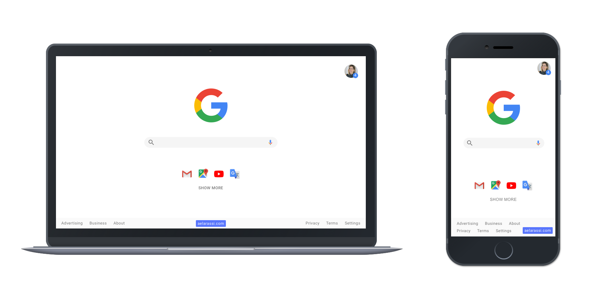

# Google Search 

Google Search — React App

## Demo

[Online-Demo]

## Tech

This project was bootstrapped with [Create React App](https://github.com/facebook/create-react-app).

- [react] - React is a JavaScript library for building user interfaces. version: 16.12.0
- [react-dom] - React package for working with the DOM. version: 16.12.0
- [react-svg] - A React component that injects SVG into the DOM. version: 11.0.11

## License

[MIT](https://choosealicense.com/licenses/mit/) © [ABDELAZIZ EL ARASSI](https://www.linkedin.com/in/aelarassi/)

[online-demo]: https://google-search-react.netlify.com/
[react]: https://reactjs.org/
[react-dom]: https://reactjs.org/
[react-svg]: https://github.com/tanem/react-svg
